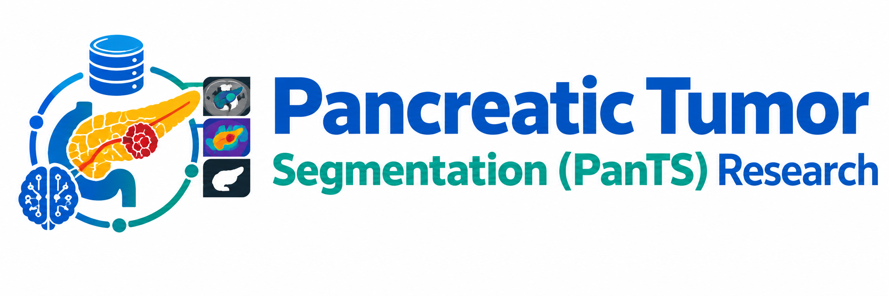
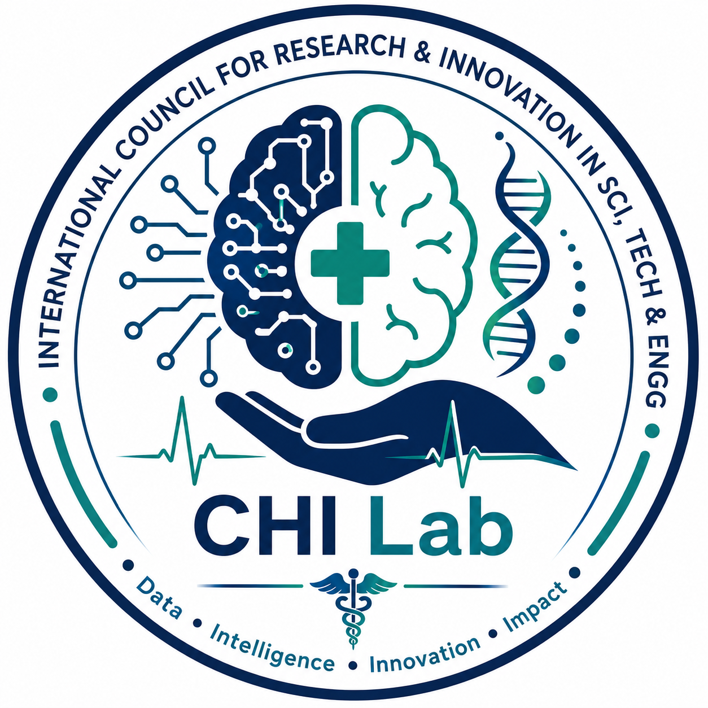
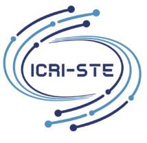

  

# Pancreatic Tumor Segmentation Reproduction Pilot

## Task
Reproduction of a pancreatic tumor segmentation pipeline following the PanTS reproduction guidance.

## Dataset
Accessible Kaggle pancreatic cancer segmentation dataset.

Pilot subset:
- Training cases: 300
- Test cases: 50
- Seed: 42

This is a small pilot and is **not** the official PanTS-tr/PanTS-te benchmark.

## Model
nnU-Net v2, 2D configuration.

## Training
- Epochs: 5
- Fold: 0
- GPUs: 1
- Checkpoint: /kaggle/working/nnUNet_results/Dataset001_PancreaticTumorPilot/nnUNetTrainer_5epochs__nnUNetPlans__2d/fold_0/checkpoint_best.pth

## Testing metrics
Dice, IoU, precision, recall and HD95.

## Output files
- `checkpoint_best.pth` — trained pilot checkpoint
- `test.py` — testing/evaluation script
- `pilot_test_metrics.csv` — per-case metrics
- `pilot_summary_metrics.csv` — mean metrics
- `predictions/` — test predictions

## Motivation

Our pancreatic tumour segmentation research is motivated by recent advances in **medical image segmentation, AI-driven radiology, and reproducible open-source research**. The following resources provide key methodological, scientific, and implementation foundations for this work.

| **Researcher / Resource** | **Research Papers & Open-Source Implementations** |
|:---|:---|
| **Prof. Dr. Zongwei Zhou** | [Website](https://www.zongweiz.com) · [PanTS GitHub Repository](https://github.com/MrGiovanni/PanTS) |
| **Relevant Research Papers** | [Paper 1](https://arxiv.org/abs/2507.01291) · [Paper 2](https://arxiv.org/abs/1912.05074) · [Paper 3](https://arxiv.org/abs/2102.04306) · [Paper 4](https://arxiv.org/abs/2203.00131) · [Paper 5](https://arxiv.org/html/2604.20981v1) |

### Key Reference: Learning Segmentation from Radiology Reports

**Learning Segmentation from Radiology Reports**  
Pedro R. A. S. Bassi, Wenxuan Li, Jieneng Chen, Zheren Zhu, Tianyu Lin, Sergio Decherchi, Andrea Cavalli, Kang Wang, Yang Yang, Alan Yuille, and Zongwei Zhou.  

**Johns Hopkins University** · **MICCAI 2025 — Best Paper Award (Runner-up)**

**Research & Implementation Resources**

### Why This Work Matters

These resources provide a foundation for developing **reproducible pancreatic tumour segmentation pipelines**, combining published medical imaging methods with publicly available implementations. Our work builds upon these foundations while focusing on **reproduction, validation, and further development of AI-based pancreatic tumour segmentation methods**.

# CHI Lab Research

This project forms part of the CHI Lab's computational healthcare and cancer research activities, integrating **Systems-Oriented Computational Research, Artificial Intelligence/Deep Learning, and Virtual Lab for AI-Driven Agentic System**.

| CHI Lab Repository | Access |
|:---|:---|
| **CHI Lab — Public Repository Research Direction on Pancreatic Cancer** |  |

---

&nbsp;&nbsp;&nbsp;&nbsp;&nbsp;

  
**CHI Lab | Computational Healthcare Intelligence | Dry Lab**

**International Council for Research & Innovation in STE (ICRI-STE)**

*From Pancreatic Cancer Segmentation to Computational Intelligence*
